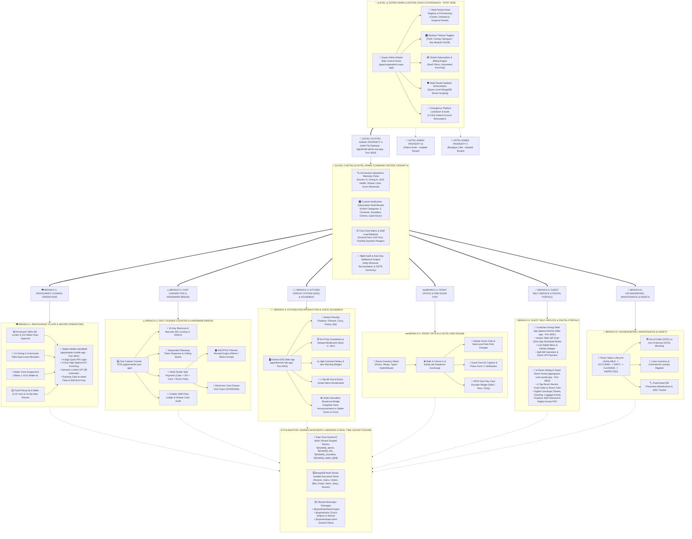

# 🌳 SPICEHUB ENTERPRISE: COMPLETE SOFTWARE ARCHITECTURE & BRANCH HIERARCHY

This document maps the entire **SpiceHub Multi-Tenant Hospitality & Restaurant Enterprise Platform** into a complete hierarchical tree structure — starting from the top-level **Super Admin (SaaS Governance)** down to **Hotel Admins (Tenants)**, operational departments, staff handhelds, hardware bridges, and database schemas.

---

## 1. Visual Master Branch Hierarchy Diagram (Tree Flowchart)



---

## 2. Granular Structural Hierarchy Tree (Text View)

```
┌────────────────────────────────────────────────────────────────────────────────────────┐
│                              🏢 LEVEL 1: SUPER ADMIN                                    │
│                    (Global SaaS Control Room & Multi-Tenant Registry)                  │
│                                Port: 3006 | Workspace: apps/superadmin-saas-app        │
└───────────────────────────────────────────┬────────────────────────────────────────────┘
                                            │
               ┌────────────────────────────┴───────────────────────────┐
               ▼                                                        ▼
┌──────────────────────────────────────────────┐       ┌─────────────────────────────────┐
│     🏨 LEVEL 2: HOTEL ADMIN (TENANT A)       │       │ 🏨 LEVEL 2: HOTEL ADMIN (TENANT B│
│       Hotel Taj Gateway & Suites             │       │      Oberoi Palace & Spa        │
│    Port: 3005 | apps/hotel-admin-erp-app     │       │    (Strict Isolated Database)   │
└──────────────────────┬───────────────────────┘       └─────────────────────────────────┘
                       │
       ┌───────────────┼───────────────┬───────────────┬───────────────┬────────────────┐
       ▼               ▼               ▼               ▼               ▼                ▼
┌──────────────┐┌──────────────┐┌──────────────┐┌──────────────┐┌──────────────┐┌──────────────┐
│  BRANCH 1:   ││  BRANCH 2:   ││  BRANCH 3:   ││  BRANCH 4:   ││  BRANCH 5:   ││  BRANCH 6:   │
│  RESTAURANT  ││ FAST CASHIER ││ KITCHEN KDS  ││ FRONT OFFICE ││ GUEST DIGITAL││ HOUSEKEEPING │
│   & WAITER   ││  COUNTER POS ││  & SOUNDBOX  ││    & PMS     ││   PORTALS    ││ & MAINTENANCE│
└──────┬───────┘└──────┬───────┘└──────┬───────┘└──────┬───────┘└──────┬───────┘└──────┬───────┘
       │               │               │               │               │               │
       ├─ Table QR     ├─ 10-Key Quick ├─ Station KDS  ├─ Room Matrix  ├─ Customer QR  ├─ Room State
       │  Locker (36)  │  Lookup (44)  │  Routing (2)  │  Setup (4)    │  Dining (3001)│  Machine (5)
       │               │               │               │               │               │
       ├─ Co-Dining    ├─ Takeaway     ├─ Delayed Prep ├─ Walk-in &    ├─ In-Room      ├─ Linen &
       │  Seats (35)   │  Tokens (44)  │  Alerts (40)  │  Check-In (66)│  Portal (3004)│  Laundry (74)
       │               │               │               │               │               │
       ├─ Floor Duty   ├─ Multi-Tender ├─ Allergen &   ├─ Master Room  ├─ Digital      ├─ Work Orders
       │  Matrix (38)  │  Split (41)   │  Jain Tag (47)│  Folio (14)   │  Concierge(10)│  & AMC (72,80)
       │               │               │               │               │               │
       ├─ Dynamic UPI  ├─ Thermal ESC/ ├─ 1-Tap 86     ├─ Govt ID &    ├─ Instant Bill ├─ Minibar &
       │  QR Gen (42)  │  POS (44)     │  Broadcast(48)│  Police C (57)│  Download(153)│  Amenities(73)
       │               │               │               │               │               │
       ├─ Waiter Float ├─ Drawer Kick  ├─ Targeted     ├─ RFID Keycard ├─ 5-Star CSAT  ├─ Asset QR
       │  Ledger (43)  │  Pulse (44)   │  Voice (42)   │  Encoder (68) │  Review (46)  │  Scanning (80)
       │               │               │               │               │               │
       └─ Waiter App   └─ Cashier Shift└─ KDS Screen   └─ Room Check-  └─ Room Service └─ Turnaround
          (Port 3002)     Float (41,44)   (Port 3003)     Out Lock(52)    Charge (151)    SLA (71)
```

---

## 3. Detailed Component Breakdown by Branch

### 🏢 Level 1: Super Admin (SaaS Governance)
* **Application Location:** `apps/superadmin-saas-app` (Port 3006)
* **Primary Actors:** SaaS Platform Owner, Global Cloud Administrators
* **Core Responsibilities:**
  1. **Multi-Tenant Property Directory:** Create, monitor, renew, or suspend hotel properties (`Tenant` model).
  2. **Feature Toggle Switchboard:** Enable or disable modules per hotel (e.g. Turn off PMS for standalone restaurants, turn off banquets for boutique cafes).
  3. **Global Subscription Engine:** Manage plan tiers (Trial, Growth, Enterprise) and automated monthly billing.
  4. **Multi-Tenant Security Wall:** Strict MongoDB query-level isolation (`hotelId` indexing across all schemas).
  5. **Global System Health:** Server resource utilization, database latency, and central error monitoring.

---

### 🏨 Level 2: Hotel Admin (Hotel ERP Command Room)
* **Application Location:** `apps/hotel-admin-erp-app` (Port 3005)
* **Primary Actors:** General Manager, Hotel Directors, Operations Head
* **Core Responsibilities:**
  1. **Omniscient Operations Telemetry Pulse (Shift 45):**
     - Real-time Dining Floor Occupancy %
     - Hotel Room PMS Occupancy %
     - Kitchen KDS Bottleneck Count (orders delayed > 15 mins)
     - Cashier Drawer Running Cash Across Terminals
     - Today Gross Sales, Net Revenue & Payment Breakdown (Cash / UPI / Card)
  2. **Custom Notification Switchboard (Shift 45):**
     - 8 Category Subscriptions (`LARGE_TRANSACTION`, `KITCHEN_DELAY`, `NEGATIVE_REVIEW`, `VOID_COMPLIMENTARY`, `CASH_DRAWER_SECURITY`, `VIP_CHECKIN`, `HOUSEKEEPING_OVERDUE`, `RESERVATION_SURGE`)
     - Multi-Channel Matrix: In-App, Desktop Popup, Counter Soundbox Chimes, SMS, Email, Webhook.
     - Quiet Hours Engine (`startTime` - `endTime`) with critical-only bypass.
  3. **Staff Floor Duty Matrix & Load Balancer (Shifts 38 & 39):**
     - Assign ground floor, 2nd floor, rooftop sections to specific waiters.
     - Automatic spillover when staff is late or overloaded.
  4. **Night Audit & Day-End Settlement (Shift 124):**
     - Auto-reconcile cash drawers, room folios, and print GSTR-1 summaries.

---

### 🍽️ Branch 1: Restaurant & Dining Floor Operations
* **Primary Actors:** Floor Captains, Waiters, Table Attendants
* **Application:** `apps/waiter-mobile-app` (Port 3002)
* **Key Sub-Modules:**
  1. **Permanent Table QR Locker (Shift 36):**
     - QR standee on table is permanent.
     - 10-second waiter auto-approval ensures guest orders never stall even during extreme rush.
  2. **Co-Dining & Seat Allocation (Shift 35):**
     - Large community tables allow multiple distinct parties to sit together without order mixing.
     - Seat-level sub-folio billing (Shift 34).
  3. **Food Pickup SLA Slider & "On My Way" Snooze (Shift 40):**
     - Configurable 2-10 min pickup alert when chef marks dish ready.
     - Waiter taps "On My Way" to snooze alert by 2 minutes without captain escalation.
  4. **Dynamic Locked UPI QR Generator (Shift 42):**
     - Waiter enters bill amount; handheld displays locked dynamic UPI QR.
     - Payment reflects instantly without guest needing to visit cashier.
  5. **Waiter Running Cash Float Ledger (Shift 43):**
     - Waiter takes cash directly at table using personal float ledger.
     - Shift-end reconciliation with Cashier drop-box.

---

### 💵 Branch 2: Fast Cashier Counter POS & Hardware Bridge
* **Primary Actors:** Cashiers, Billing Clerks, Accountants
* **Application:** `apps/cashier-pos-app` & Electron Desktop App (Shift 89)
* **Key Sub-Modules:**
  1. **High-Speed Counter Ordering (Shift 44):**
     - 10-key numeric shortcut lookup (`101` -> Veg Burger).
     - Barcode SKU scanner integration (< 500ms latency).
  2. **Sequential Takeaway Token Dispenser & Calling Board (Shift 44):**
     - Auto-increments daily tokens (`#1`, `#2`, `#3`).
     - Real-time guest calling board with 3 states (`PREPARING`, `READY_FOR_PICKUP`, `COMPLETED`).
  3. **Multi-Tender Split Payment Settlement (Shifts 41 & 44):**
     - Instant split settlement (e.g. ₹500 Cash + ₹700 UPI).
     - Atomic Compare-And-Swap (CAS) to eliminate double-settlement concurrency races.
  4. **Hardware Driver Integration (Shift 44 & 89):**
     - **ESC/POS Thermal Printing:** Binary ESC/POS byte buffers for 58mm and 80mm receipt printers.
     - **Cash Drawer Kick Pulse:** Transmits pulse hex code (`\x1b\x70\x00\x19\xfa`) over serial/USB to kick drawer open.
  5. **Cashier Shift Float Ledger (Shift 41):**
     - Opening float, total cash collected, change returned, and expected drawer balance tracking.

---

### 👨‍🍳 Branch 3: Kitchen Display System (KDS) & Voice Soundbox
* **Primary Actors:** Executive Chef, Line Cooks, Kitchen Stewards
* **Application:** `apps/kitchen-kds-app` (Port 3003)
* **Key Sub-Modules:**
  1. **Station-Wise Ticket Dispatch (Shift 2):**
     - Real-time socket delivery to specific station screens (Tandoor, Chinese, Curry, Pantry, Bar).
  2. **Live Cook Countdown & SLA Delayed Alerts (Shift 40):**
     - Visual color-coded ticket timers (Green -> Amber -> Red).
     - Tickets exceeding 15 minutes trigger manager alerts and Soundbox audio chime.
  3. **High-Contrast Allergen & Dietary Badges (Shift 47):**
     - Bold indicators for Jain, No Onion/Garlic, Gluten-Free, Vegan, and Nut Allergies.
  4. **1-Tap 86 (Out-of-Stock) Instant Broadcast (Shift 48):**
     - Chef marks an ingredient finished; immediately removes dish from customer QR menus and waiter handhelds.
  5. **Audio Voice Soundbox Bridge (Shift 42 & 45):**
     - Synthesizes spoken voice announcements to the floor (*"Order ready for Table 12"*).

---

### 🛏️ Branch 4: Front Office & PMS Room Stay
* **Primary Actors:** Front Desk Receptionists, Concierge, Night Auditor
* **Application:** Integrated in `apps/hotel-admin-erp-app` & Desk Tablets
* **Key Sub-Modules:**
  1. **Room Inventory & State Matrix (Shift 4):**
     - Real-time room grid categorized by Floor, Wing, and Room Type (Deluxe, Suite, Presidential).
  2. **Walk-In Check-In & Early/Late Charges (Shifts 66 & 67):**
     - Instant registration, rate calculation, and automated early/late departure surcharges.
  3. **Master Room Folio Engine (Shift 14):**
     - All in-room dining, spa, and laundry expenses routed directly into the guest room folio.
  4. **Government ID & Police Verification (Shift 57):**
     - Photo ID scan, Form C for foreign nationals, and instant local police reporting.
  5. **RFID Keycard Encoder Bridge (Shift 68):**
     - Hardware encoder integration for Salto, Tesa, and Onity contactless door keys.
  6. **Room Check-Out Atomic Folio Lock (Shift 52):**
     - Sweeps pending restaurant charges before guest leaves the property.

---

### 📱 Branch 5: Public Guest Self-Service & Digital Portals
* **Primary Actors:** Hotel Guests, Restaurant Diners, Walk-In Visitors
* **Applications:**
  - `apps/customer-table-app` (Port 3001) - Table QR Self-Service
  - `apps/guest-room-portal-app` (Port 3004) - In-Room Dining & Concierge
* **Key Sub-Modules:**
  1. **Dual Customer Access Modes:**
     - **Instant QR Mode:** Scan QR standee with phone camera; opens zero-download high-speed PWA in mobile browser.
     - **Play Store App Mode (Shifts 88-90):** Native Android/iOS app with hotel switcher and local memory.
  2. **In-Room Dining (Room Service):**
     - Guest orders food directly from bed; charges post to room folio with 1 tap.
  3. **Digital Concierge:**
     - Towel requests, room cleaning scheduling, luggage assistance, laundry pickup.
  4. **Self-Checkout & Digital Invoice:**
     - Instant UPI payment with automatic GST-compliant PDF invoice download.
  5. **5-Star CSAT Rating & Service Recovery (Shift 46):**
     - Negative ratings (1-2 stars) trigger immediate manager escalation before guest departs.

---

### 🧹 Branch 6: Housekeeping, Maintenance & Facility Assets
* **Primary Actors:** Housekeeping Supervisors, Room Attendants, Maintenance Engineers
* **Application:** Handheld Tablet View in `apps/waiter-mobile-app`
* **Key Sub-Modules:**
  1. **Room Cleaning Lifecycle (Shifts 5 & 71):**
     - Strict state transitions: `AVAILABLE` ➔ `OCCUPIED` ➔ `DIRTY` ➔ `CLEANING` ➔ `INSPECTED` ➔ `AVAILABLE`.
  2. **Out-of-Order (OOO) vs Out-of-Service (OOS) Blocking (Shift 72):**
     - Blocks rooms from PMS availability during plumbing/electrical repair.
  3. **Linen & Laundry Tracking (Shift 74):**
     - Commercial laundry exchange register, bedsheet/towel par levels.
  4. **Fixed Asset QR Preventive Maintenance (Shift 80):**
     - QR codes on AC units, boilers, and kitchen ovens with warranty and service schedules.

---

## 4. Multi-Tenant Network & Port Topology

| Node / Application | Port | Role & Primary Audience | Technology Stack |
| :--- | :---: | :--- | :--- |
| **Central Backend API Engine** | **5000** | REST APIs, Socket.IO, Multi-Tenant Auth | Node.js, Express, MongoDB, Socket.IO |
| **Customer Dining Table App** | **3001** | Table QR Digital Ordering & Split Billing | React, Vite, TailwindCSS, PWA |
| **Waiter Mobile Operations App** | **3002** | Waiter Handheld, 4-Digit PIN, 3-Click KOT | React, Vite, Touch-Optimized UI (48px) |
| **Kitchen KDS Display App** | **3003** | Chef Stations, Delayed Prep Timers | React, Vite, High-Contrast UI |
| **Guest Room Portal App** | **3004** | In-Room Dining, Concierge, Room Folio | React, Vite, PWA |
| **Hotel Admin ERP App** | **3005** | GM Telemetry, Switchboard, Duty Matrix | React, Vite, Desktop Dashboard |
| **Super Admin SaaS Governance** | **3006** | Multi-Tenant Registry, Global Subscriptions | React, Vite, SaaS Control Room |

---

## 5. Master Monorepo Package Dependencies

```
[spicehub-monorepo]
   │
   ├── packages/
   │    ├── @spicehub/shared-types      (Global TypeScript interfaces, Enums, Roles)
   │    ├── @spicehub/ui                (Touch-first 48px Helpers, Stores, Sound Synthesizers)
   │    └── @spicehub/api-client        (Unified Axios client & SpiceHubSocket engine)
   │
   ├── backend/
   │    ├── src/models/                 (60+ MongoDB Mongoose Data Schemas)
   │    ├── src/controllers/            (Business Logic, Concurrency Handlers, CAS Locks)
   │    ├── src/routes/                 (Versioned REST Endpoints: /api/v1/...)
   │    └── src/__tests__/              (Zero-Mock Supertest Test Suites across Dedicated Ports)
   │
   └── apps/
        ├── customer-table-app          (Port 3001)
        ├── waiter-mobile-app           (Port 3002)
        ├── kitchen-kds-app             (Port 3003)
        ├── guest-room-portal-app       (Port 3004)
        ├── hotel-admin-erp-app         (Port 3005)
        └── superadmin-saas-app         (Port 3006)
```

---

*Verified & Compiled for SpiceHub Hospitality Enterprise System Architecture.*
